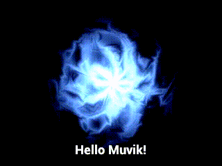

# SGVideo

This is the video generation component of the
MuvikAI engine. It can be used to procedurally generate
h264 video content using lua, cairo, h264, and ffmpeg.

## Prerequisites
SGVideo only works on Linux and OSX.

A standard C build environment with GNU Make is needed for
building.

[libx264](https://www.videolan.org/developers/x264.html) is
used for h264 video encoding.

[libcairo](https://www.cairographics.org/) for 2d vector
graphics.

[ffmpeg](https://www.ffmpeg.org/) for creating mp4 video
containers.

These dependencies are usually are readily available through
the package manager that your operating system provides.

# Compilation

To build, run `make`. This should build a binary called
`sgvideo`.

Run the test file with `./sgvideo test.lua`. With any luck,
a file called `test.mp4` should appear.